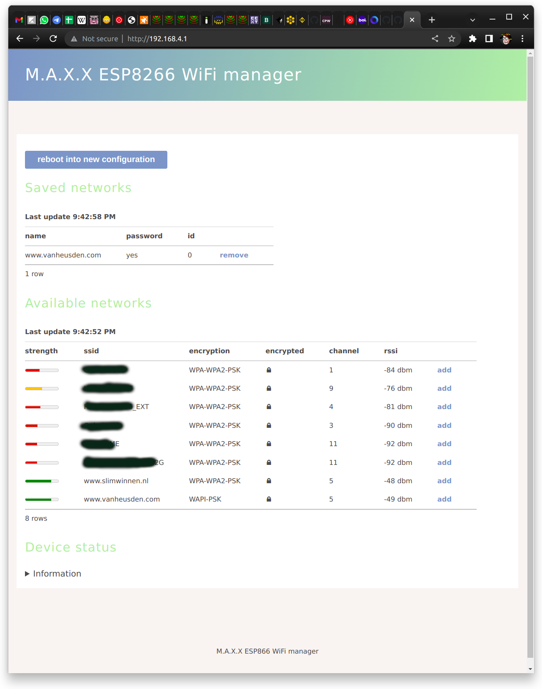

M.A.X.X is a wifi manager for the ESP8266. It allows more than one access point to be configured.

See test.ino for a usage example.

Please note that this is not entirely finished albeit usuable.
Pull requests are welcome! (or patches by e-mail)

Screenshot:

The only external dependency is "ArduinoJson" (by bblanchon - it is automatically installed by the platformio-script).

--- Folkert van Heusden <mail@vanheusden.com>

The program is named after Max. Max is a dog who has no knowledge about WiFi but wholeheartedly supports the development of this library!

This is a picture of Max:

